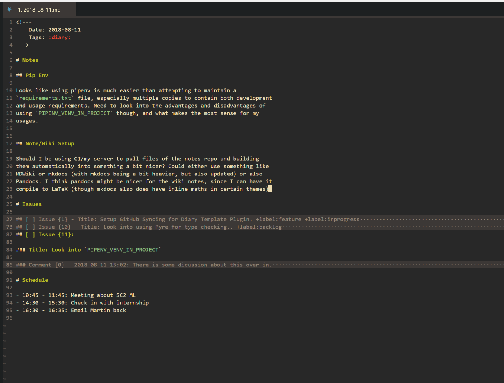

# nvim_diary_template

Test repo for a plugin to generate a suitable template for VimWiki (for me).
This was mainly made to let me mess with various Python features, like the
NeoVim API, pipenv, mypy and more, there is a million and one simpler ways to
achieve this. The README here currently mainly stands more to give myself a
reminder where and how things are setup.

## Features:
- Google Calendar Integration:
    - Make a Diary entry, and have it auto-populated with todays events
      from GCal.
    - Any new events that are added, can be synced to GCal.
    - **TODO**: Add rename and remove syntax, such that events can be removed
      or edited.
- GitHub Issues Integration:
    - Use a Private repo on GitHub as an issue tracker, synced with your text
      diary. This is useful for ToDos, as well as keeping logs of how the todos
      are progressing.
    - Issues you make online and in-diary are synced, along with all
      comments.
    - Support for Github labels (including Deoplete source), including sorting
      by labels (needs config adding for this, currently a set sort order).
- Diary outline generation:
    - Builds a diary file with metadata in and the defined headings.

## Screenshot:



## Config:

Install with `vim-plug` like so, as well as ensuring the python env used with
Neovim has the required packages.

```viml
Plug 'CrossR/nvim_diary_template', { 'do': ':UpdateRemotePlugins' }
```

### Basics:

Add the following to  your `init.vim`, which sets the location of your
notes and the location of your config.

```viml
let g:nvim_diary_template#notes_path = "some/path/wiki/docs/"
let g:nvim_diary_template#config_path = "some/path/wiki/config/"

" If you don't want GCal or GitHub integration.
let g:nvim_diary_template#use_github_repo = 0
let g:nvim_diary_template#use_google_calendar = 0
```

Google Calendar and GitHub integration need a bit of manual work to get them
setup, which is outlined below.

### GitHub

Generate an access token at Settings > Developer Settings > Personal access
tokens on GitHub. Put this generated token in your config folder, in a json file
called `github_credentials.json` with the structure:

```json
{"access_token": "XXX"}
```

Once this is added, add the following to your `init.vim`, to tell the plugin
where your GitHub repo is:

```viml
let g:nvim_diary_template#repo_name = 'CrossR/nvim_diary_template'
```

Now, when generating a diary, all issues should be pulled in.

### Google

This requires a few things, so a script (`generate_google_credentials.py`)
is included, to help produce the correct auth file.

First, generate a set of API keys on the [Google API
Dashboard](https://console.developers.google.com).
This is done by making a new project, then making a new set of credentials under
"Credentials". After giving it any name, download the config file and rename it
to `client_secret.json`, before running the included
`generate_google_credentials.py` script on it, to make the final authentication
file. This final `credentials.json` should then be put in your config folder.

Now, just add the following to your `init.vim` to configure the plugin to use
Google Calendar:

```viml
" This sets the calendar the plugin will use, and must already exist.
let g:nvim_diary_template#google_cal_name = 'NVim Notes'

" This is an array that lets you ignore certain calendars.  It may be easiest
" to sync once, then check the calendar names from the cache file (in the config
" folder) to set this array.
let g:nvim_diary_template#calendar_filter_list = ['Holidays in United Kingdom']
```

### Other options

The expected time zone for both issues and calendar events can be set with:

```viml
let g:nvim_diary_template#timezone = 'Europe/London'
```

The heading list (outside of Issues and Schedule), can be set with:

```viml
let g:nvim_diary_template#daily_headings = ["Notes", "Meetings"]
```
